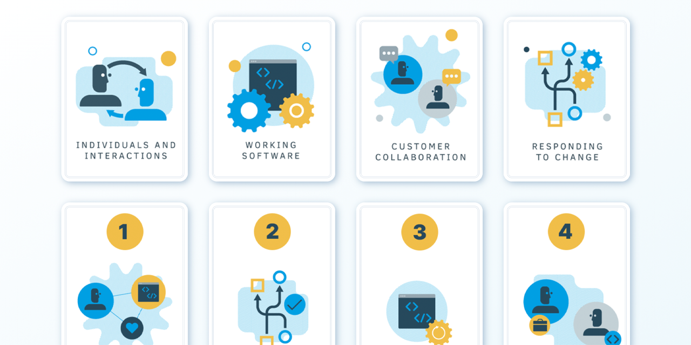

<p id="header"><p>

<table><tr>
<td> <a href="https://github.com/emjose/take-a-guess/#header"></a> </td>
<td> <a href="https://github.com/emjose/one-hundred/#header"></a> </td>
<td> <a href="https://github.com/emjose/js-notes-app#header"></a> </td>

</tr></table>

<br>

<p id="project-title"><p>

<a href=#table-of-contents></a>

<br>

<a href="https://agile-101.vercel.app/"></a>

#

<p id="table-of-contents"><p>

<a href=#table-of-contents></a>

-   [100 Days of Code](#100days)
-   [Installation](#installation)
-   [Live Site](#live-site)
-   [Issues](#issues)
-   [Resources](#resources)
-   [Copyright](#copyright)
-   [Let's Connect!](#lets-connect)

#

<p id="100days"><p>

<a href=#100days></a>

### Day 31: November 29, 2021

-   I am learning about the <a href="https://agilemanifesto.org/">Agile Manifesto</a>, which is a set of values and principles.

-   The Agile Manifesto is used to guide teams in the decision-making of software development, and Agile methodologies are popular in project management.

-   As a personal study guide, I created flip cards of the 4 values and 12 principles of the Agile Manifesto.

-   Companion project to Agile 101: <a href="https://github.com/emjose/design-patterns-101/#header">Design Patterns 101</a>.

-   The graphics and material are from <a href="https://www.scrumalliance.org/agile-organizations/manifesto">Scrum Alliance</a> and <a href="https://selleo.com/blog/agile-values-and-principles-do-they-still-matter">Selleo</a>. Images formatted with Adobe Photoshop.

#

<p id="installation"><p>

<a href=#installation></a>

#### Git clone and cd into the repo folder:

```
git clone git@github.com:emjose/agile-101.git && cd agile-101
```

#### Run the command:

```
open index.html
```

#

<p id="live-site"><p>

<a href="https://agile-101.vercel.app/"></a>

<a href="https://agile-101.vercel.app/"></a>

Flip cards explain the 4 values and 12 principles of the Agile Manifesto.

#

<p id="issues"><p>

<a href=#issues></a>

-   After deploying Agile 101 on <a href="https://vercel.com">Vercel</a>, I discovered that the cards didn't flip correctly on a mobile phone.

-   The primary issue is that <a href="https://developer.mozilla.org/en-US/docs/Web/CSS/:hover">the `:hover` pseudo class is problematic on touchscreens</a>, since there are no cursor/mouse devices present.

-   Stack Overflow questions ( <a href="https://stackoverflow.com/questions/22559756/changing-hover-to-touch-click-for-mobile-devices">One</a> • <a href="https://stackoverflow.com/questions/19792575/css3-flip-functionality-problems-with-backface-visibility">Two</a> ) led to the solutions of adding `:focus` to CSS properties and `tabindex="0"` to HTML elements.

-   The <a href="https://developer.mozilla.org/en-US/docs/Glossary/Vendor_Prefix">vendor prefixes</a> (`-webkit-`, `-moz-`, `-ms-`, `-o-`) were also added to the transform and backface-visibility CSS properties.

-   A remaining issue with touchscreen devices: Tapping a card may yield a partial blue outline that doesn't correctly surround the card. However, cards will flip correctly when tapped.

<br>

<a href="https://agile-101.vercel.app/"></a>

<br>

• A regular mouse hover will still flip a card without clicking.

• With `:focus` now in place, Agile 101 is now keyboard accessible.

• Pressing the tab key (or a mouse click) can pause a selected card in its flipped state.

• A tab key press or a mouse click **outside** of the card reverts the card back to its initial state.

• On a touchscreen device: tapping another card will flip the previously selected card back to its initial state.

#

<p id="resources"><p>

<a href=#resources></a>

-   #### [Creating a Card Flip by Dong Xia](https://dong-xia.medium.com/creating-a-card-flip-i-challenge-you-to-a-duel-4e4e124c5060)

-   #### [How TO - Flip Card](https://www.w3schools.com/howto/howto_css_flip_card.asp)

-   #### [Adobe Photoshop](https://www.adobe.com/products/photoshop/free-trial-download.html)
-   #### [The Agile Manifesto](http://agilemanifesto.org/)

-   #### [Video: What is Agile?](https://www.youtube.com/watch?v=Z9QbYZh1YXY)

-   #### [Agile Manifesto Graphics](https://www.scrumalliance.org/agile-organizations/manifesto)

-   #### [What is the Agile Manifesto?](https://airfocus.com/glossary/what-is-agile-manifesto/)

-   #### [Agile Values And Principles - Do They Still Matter?](https://selleo.com/blog/agile-values-and-principles-do-they-still-matter)

-   #### [My blog on how I created my Github READMEs](https://emmanueljose.medium.com/readme-a-makeover-story-b9c7be37a6de?sk=7ae6623d365409d875753e4604e42ffd)

#

<p id="copyright"><p>

<a href=#copyright></a>

-   This project is for made for educational purposes only.
-   Graphics and material are copyright of <a href="https://www.scrumalliance.org/">Scrum Alliance</a> and <a href="https://selleo.com/blog/agile-values-and-principles-do-they-still-matter">Selleo</a>. © Scrum Alliance. © Selleo. All Rights Reserved.

#

<p id="lets-connect"><p>

<a href=#lets-connect></a>

<p><a href="https://twitter.com/Emmanuel_Labor"> <a href="https://www.linkedin.com/in/emmanuelpjose/"> <a href="https://emmanueljose.medium.com/"> <a href="https://www.instagram.com/emmanuel_jose/"> <a href="mailto:emjose@gmail.com"> <a href="https://www.emmanuel-jose.com/"> <a href="https://github.com/emjose"></p>

#

<a href=#header></a>
